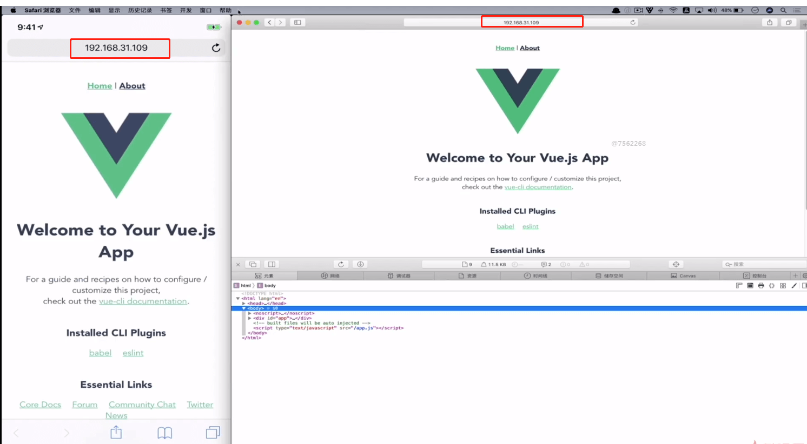

# 真机调试

### safari + IOS 真机调试

1. 设置safari浏览器的开发模式

 选择"高级" --> 勾选开发菜单

2. 设置IOS
 打开ios safari浏览器的Web检查器
 

 3. 手机和电脑处于同一局域网
 查看mac上的局域网ip  ifconfig
 

4. 在safari浏览器中调试手机页面

### Chrome + Android 调试

1. chrome浏览器中输入 chrome://inspect/#devices

2. 设置android手机开发者模式
 进入开发者模式 --> 开发者选项 --> 打开开发者选项，USB调试 

**注意** 
 1. 需要usb链接
 2. 需要在同一个局域网
 3. 如果点击inspect后长时间处于白屏，1） 查看chrome浏览版本，升级为最新版本；2）查看手机版的浏览是否为最新或者下载手机版chrome浏览器； 3） 打开谷歌浏览器的虚拟专有网络。